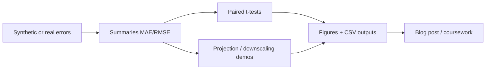
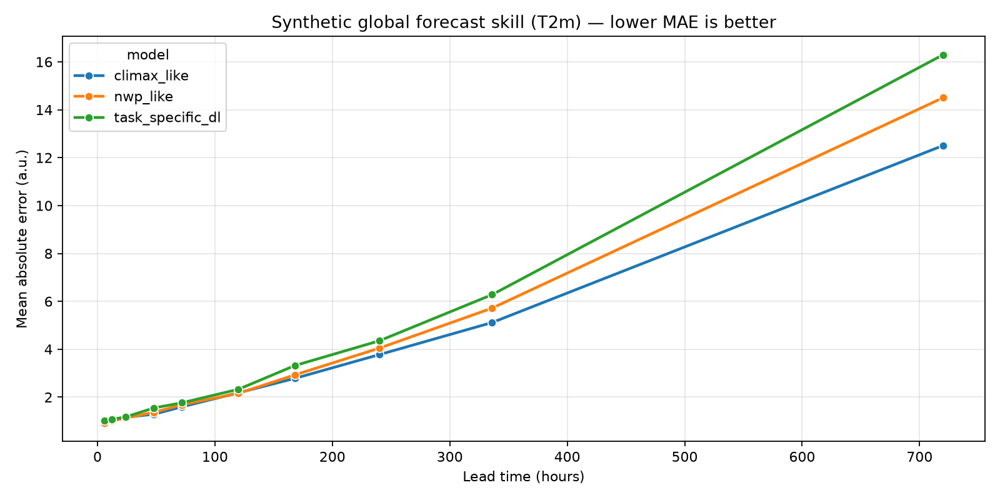
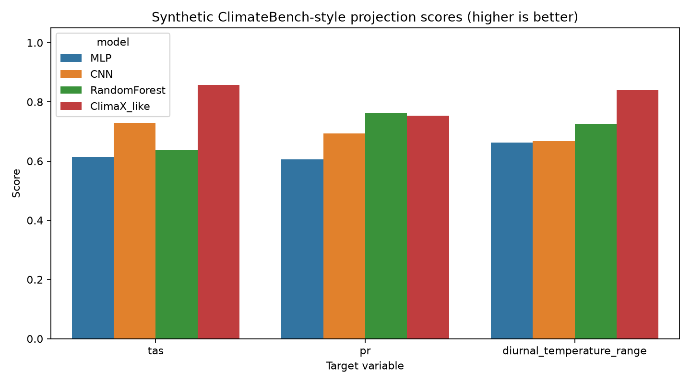
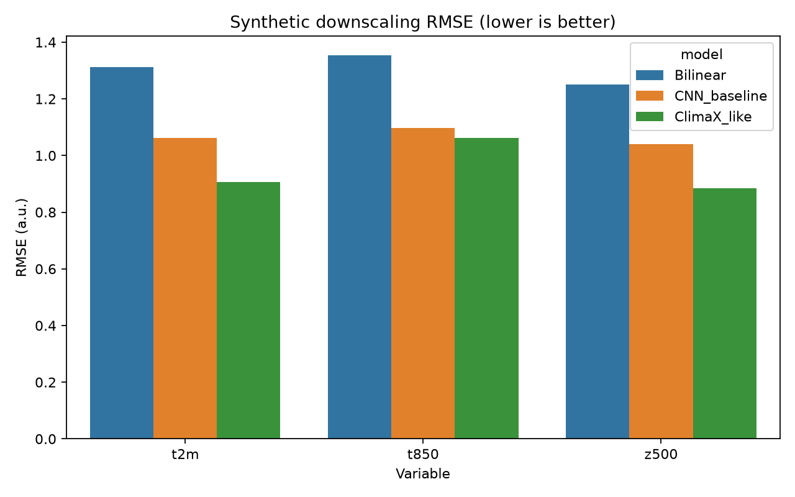
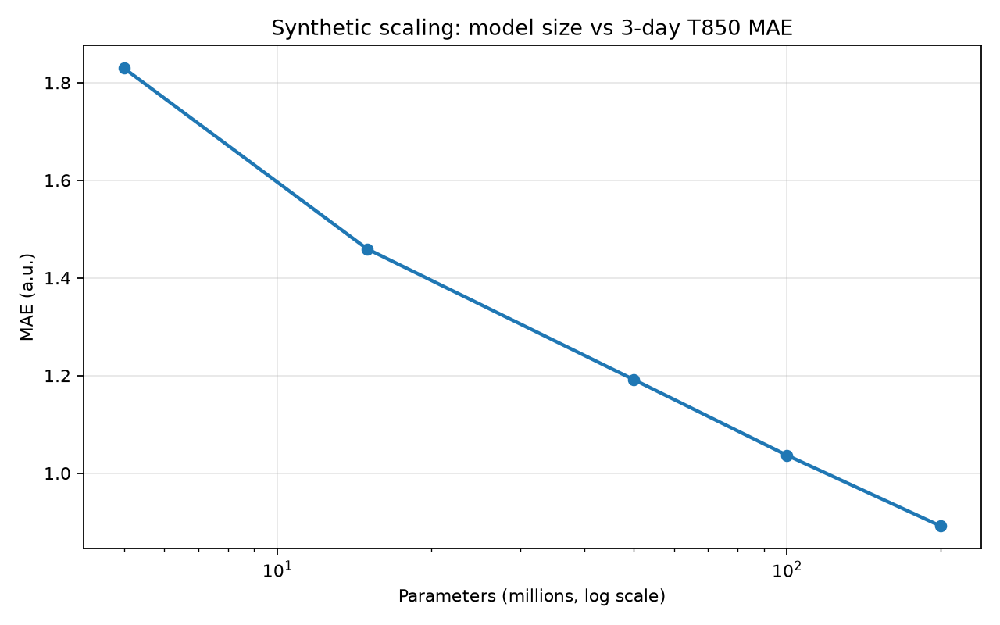

# ClimaX: A Foundation Model for Weather and Climate

A comprehensive research-review and reproducible analysis project for **Nguyen et al. (ICML 2023)**, *ClimaX: A foundation model for weather and climate*. The repository combines a structured scientific blog post with equivalent **Python**, **R**, and **Jupyter** workflows that illustrate forecast skill, ClimateBench-style projection transfer, downscaling, and scaling-law ideas using transparent **synthetic** data.

> Educational / review companion — not an official reproduction of Microsoft ClimaX training or ERA5/CMIP6 downloads. For production ClimaX usage, see [microsoft/ClimaX](https://github.com/microsoft/ClimaX).

## Table of Contents

- [Overview](#overview)
- [Paper at a Glance](#paper-at-a-glance)
- [Features](#features)
- [Project Structure](#project-structure)
- [Installation](#installation)
- [Usage](#usage)
- [Data Format](#data-format)
- [Analysis Workflow](#analysis-workflow)
- [Outputs](#outputs)
- [Interpreting Results](#interpreting-results)
- [Adapting to Real ClimaX Workflows](#adapting-to-real-climax-workflows)
- [Scientific Blog Post](#scientific-blog-post)
- [Reproducibility Notes](#reproducibility-notes)
- [Visualizations](#visualizations)
- [References](#references)
- [License](#license)

## Overview

ClimaX extends Vision Transformers with **variable tokenization** and **variable aggregation** so a single backbone can train on heterogeneous climate datasets (CMIP6-derived) and finetune for weather forecasting, climate projection, and downscaling—including variables and scales unseen during pretraining.

This project helps you:

1. Read and critically review the paper using a guideline-aligned blog post.
2. Run a lightweight evaluation narrative locally (no large NetCDF downloads required).
3. Practice descriptive and inferential statistics on forecast-error comparisons.
4. Keep a clear upgrade path toward the official ClimaX codebase and WeatherBench/ClimateBench data.

## Paper at a Glance

| Item | Detail |
|---|---|
| Title | ClimaX: A foundation model for weather and climate |
| Authors | Tung Nguyen, Johannes Brandstetter, Ashish Kapoor, Jayesh K. Gupta, Aditya Grover |
| Venue | ICML 2023 (PMLR 202:25904–25938) |
| Preprint | [arXiv:2301.10343](https://arxiv.org/abs/2301.10343) |
| Official code | [github.com/microsoft/ClimaX](https://github.com/microsoft/ClimaX) |
| Pretraining | Self-supervised objective on CMIP6-derived datasets |
| Downstream | Global/regional forecast, ClimateBench projection, downscaling |

## Features

- Guideline-aligned scientific review blog post
- Dual-language analysis (`Python` + `R`) with matching metrics and plots
- Interactive Jupyter notebook for narrative walkthrough
- Synthetic forecast skill curves vs lead time (foundation vs task-specific vs NWP-like)
- Paired *t*-tests of absolute errors with *p*-values
- ClimateBench-style and downscaling demo tables/figures
- Scaling-curve illustration (model size vs skill)
- MIT-licensed GitHub scaffolding (`.gitignore`, `.gitattributes`, `LICENSE`, `requirements.txt`)

## Project Structure

```text
.
├── assets/
│   ├── overview.png                 # README overview figure
│   ├── forecast_skill_t2m.png       # lead-time skill curve
│   ├── climatebench_scores.png      # projection score bars
│   ├── downscaling_rmse.png         # downscaling comparison
│   └── scaling_curve.png            # model-size scaling demo
├── data/
│   ├── raw/
│   │   └── .gitkeep                 # optional real CSV inputs later
│   └── processed/
│       └── .gitkeep                 # exported tables from analysis
├── outputs/
│   └── .gitkeep                     # figures + summary CSVs
├── climax_foundation_analysis.py    # primary Python pipeline
├── climax_foundation_analysis.R     # equivalent R pipeline
├── climax_foundation_review_notebook.ipynb
├── .gitattributes
├── .gitignore
├── LICENSE
├── requirements.txt
└── README.md
```

> `Guidelines_Research_Paper_Review.txt` and `Research_Paper_Review_Blog_Post.md` are kept locally for coursework and are excluded from version control.
## Installation

### Python

```bash
python -m venv .venv
.\.venv\Scripts\Activate.ps1
pip install -r requirements.txt
```

### R

```r
install.packages(c("tidyverse", "ggplot2", "dplyr", "tidyr"))
```

## Usage

### Python script

```bash
python climax_foundation_analysis.py
```

Optional custom output directory:

```bash
python climax_foundation_analysis.py --outdir outputs
```

### R script

From the project root:

```r
source("climax_foundation_analysis.R")
```

Or in a terminal (if `Rscript` is on `PATH`):

```bash
Rscript climax_foundation_analysis.R
```

### Notebook

```bash
jupyter notebook climax_foundation_review_notebook.ipynb
```

## Data Format

By default, all datasets are **generated synthetically** inside the scripts (seeded for reproducibility).

If you later add real evaluation exports, place CSVs under `data/raw/` using columns compatible with the processed schema, for example:

**Forecast absolute errors**

| column | description |
|---|---|
| `sample_id` | sample index |
| `variable` | e.g. `t2m`, `t850`, `z500`, `u10` |
| `lead_hours` | forecast lead time |
| `model` | model name |
| `abs_error` | absolute error |

**ClimateBench-style scores**

| column | description |
|---|---|
| `target` | projection target (e.g. `tas`) |
| `model` | model name |
| `score` | higher is better |

## Analysis Workflow

1. Create `data/`, `outputs/`, and `assets/` directories.
2. Generate synthetic absolute-error samples across leads, variables, and models.
3. Compute MAE / median / SD / RMSE summaries.
4. Run paired *t*-tests (`task_specific_dl` vs `climax_like`).
5. Build ClimateBench-style, downscaling, and scaling demo tables.
6. Export CSV + PNG artifacts for the review write-up.



## Outputs

Typical artifacts after a Python run:

| Path | Description |
|---|---|
| `outputs/forecast_skill_summary.csv` | MAE/RMSE by model × variable × lead |
| `outputs/forecast_paired_ttests.csv` | *t* statistics and *p*-values |
| `outputs/climatebench_scores.csv` | Synthetic projection scores |
| `outputs/downscaling_rmse.csv` | Synthetic downscaling RMSE |
| `outputs/scaling_curve.csv` | Toy scaling law points |
| `outputs/forecast_skill_t2m.png` | Lead-time skill curve |
| `outputs/climatebench_scores.png` | Projection bar chart |
| `outputs/downscaling_rmse.png` | Downscaling bar chart |
| `outputs/scaling_curve.png` | Scaling plot |
| `assets/*.png` | README figures (skill, projection, downscaling, scaling) |
| `data/processed/*.csv` | Parallel processed copies |

R runs write analogous `*_r.csv` / `*_r.png` filenames.

## Interpreting Results

- **Lower MAE/RMSE** is better for forecast and downscaling demos.
- **Higher score** is better for ClimateBench-style demos.
- Significant paired tests (`p < 0.05`) indicate synthetic evidence that `climax_like` errors are smaller than `task_specific_dl` at that lead—**illustrative only**.
- Do not treat synthetic rankings as official paper numbers; use them to practice the evaluation *logic*.

## Adapting to Real ClimaX Workflows

1. Follow official docs: [microsoft.github.io/ClimaX](https://microsoft.github.io/ClimaX/).
2. Prepare WeatherBench/ERA5 (forecasting) and ClimateBench (projection) data.
3. Load pretrained checkpoints (e.g. 5.625° / 1.40625°).
4. Replace synthetic generators with truth–forecast joins on valid time, variable, and grid.
5. Keep metric and plotting interfaces stable for fair before/after comparisons.
6. Add uncertainty, extremes, and regional verification as needed.

## Scientific Blog Post

A local critical review write-up (`Research_Paper_Review_Blog_Post.md`) accompanies this project for coursework and is gitignored from the public portfolio push. Use the notebook and scripts here for the reproducible technical narrative.
## Reproducibility Notes

- Fixed random seeds in Python (`2023`) and R (`set.seed(2023)`).
- Explicit synthetic assumptions documented in script docstrings.
- Separate processed vs outputs folders for tables and figures.
- Clearly label educational demos versus official ClimaX results in any report.

## Visualizations

Figures below are regenerated by `python climax_foundation_analysis.py` and copied into `assets/` for the README.

### 1. Global forecast skill (T2m)

Synthetic mean absolute error versus lead time for ClimaX-like, task-specific deep learning, and NWP-like error regimes. Lower MAE is better; the foundation-style curve degrades more slowly at long leads.



### 2. ClimateBench-style projection scores

Transfer-style demo for climate projection targets (`tas`, `pr`, diurnal temperature range). Higher score is better; ClimaX-like transfer is competitive despite unseen variables in the paper narrative.



### 3. Climate downscaling RMSE

Coarse-to-fine downscaling comparison across key atmospheric variables. Lower RMSE is better.



### 4. Scaling law illustration

Toy relationship between pretrained model size and 3-day T850 MAE (log x-axis), echoing the paper’s finding that larger models and more data improve downstream skill.



> Demonstration figures from synthetic/demo inputs unless licensed ERA5/CMIP6-derived evaluation exports are provided locally.

## References

- Nguyen, T., Brandstetter, J., Kapoor, A., Gupta, J. K., & Grover, A. (2023). *ClimaX: A foundation model for weather and climate*. Proceedings of the 40th International Conference on Machine Learning. https://proceedings.mlr.press/v202/nguyen23a.html
- Nguyen et al. (2023). arXiv:2301.10343. https://doi.org/10.48550/arXiv.2301.10343
- Microsoft Research. *Introducing ClimaX*. https://www.microsoft.com/en-us/research/articles/introducing-climax-the-first-foundation-model-for-weather-and-climate/
- Official repository: https://github.com/microsoft/ClimaX

## License

MIT License. See [`LICENSE`](LICENSE).

**Last Updated**: July 2026
