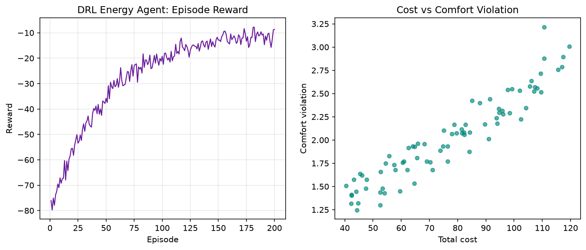

# Deep Reinforcement Learning for Energy Systems

A comprehensive DRL project for optimizing multi-energy system operation under uncertainty. The repository includes a Gymnasium-compatible environment, training scripts with `stable-baselines3`, notebook workflows, and R-based result analysis.

## Table of Contents

- Overview
- Features
- Project Structure
- Installation
- Usage
- Environment Design
- Outputs
- Extensions
- License

## Overview

This project provides a practical framework for studying deep reinforcement learning in coupled electric-thermal energy systems. It is designed to be fast enough for local experimentation while still exposing realistic control objectives such as cost minimization and thermal comfort.

## Features

- Custom toy multi-energy RL environment
- PPO training workflow with configurable timesteps and seeds
- Notebook for interactive experimentation and visualization
- R diagnostics script for post-training analysis
- Modular design for replacement with real system dynamics

## Project Structure

```text
.
├── src/
│   ├── drl_energy_env.py
│   └── train_sb3.py
├── notebooks/
│   └── drl_multi_energy_workflow.ipynb
├── r/
│   └── analysis.R
├── .gitattributes
├── .gitignore
├── LICENSE
├── requirements.txt
└── README.md
```

## Installation

```bash
python -m venv .venv
.\.venv\Scripts\activate
pip install -r requirements.txt
```

Optional R packages:

```r
install.packages(c("ggplot2", "dplyr", "readr"))
```

## Usage

### Train PPO agent

```bash
python -m src.train_sb3 --timesteps 50000 --seed 0
```

### Notebook

```bash
jupyter notebook notebooks/drl_multi_energy_workflow.ipynb
```

### R analysis

```bash
Rscript r/analysis.R
```

## Environment Design

The environment models a coupled electricity + thermal control problem:

- Observations include `soc`, indoor temperature, PV, load, ambient temperature, and tariff.
- Actions include battery power and heat-pump power commands.
- Reward balances electricity cost against indoor comfort penalties.

## Outputs

Typical local artifacts:

- trained models under `outputs/models/`
- evaluation summaries and plots under `outputs/`
- optional R figures under `outputs/r/`

## Extensions

- Integrate real load/weather/tariff datasets
- Add constrained RL formulations and action projection
- Compare RL against rule-based control and MPC baselines
- Add robustness testing under forecast and parameter uncertainty
- Add experiment tracking and benchmark suites


## Visualizations

A committed overview figure for this project (regenerated by the primary analysis/demo script when available):



Episode reward learning curve for an energy-system RL agent and a cost-vs-comfort tradeoff scatter.

> Demonstration figure from synthetic/demo or literature-summary inputs unless a licensed dataset is provided locally.

## License

MIT License. See `LICENSE`.

**Last Updated**: August 2025
