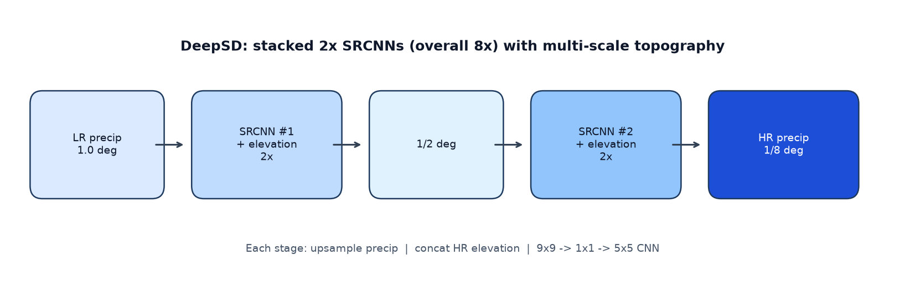
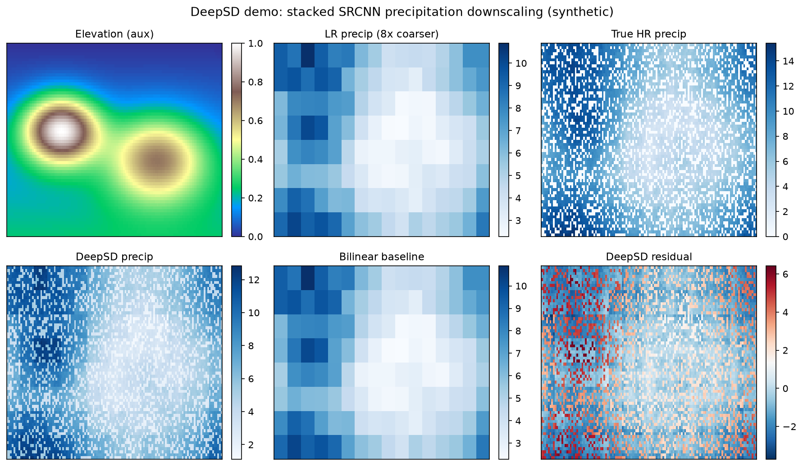
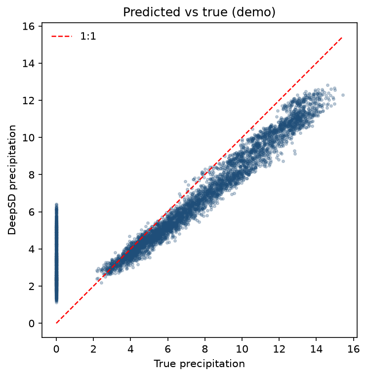
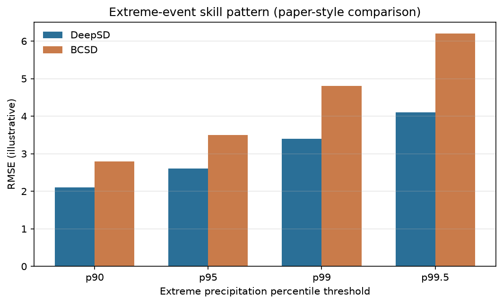

# DeepSD: High-Resolution Climate Projections via Single-Image Super-Resolution

Educational and reproducible companion repository for reviewing **Vandal et al. (2017)** — *DeepSD: Generating High Resolution Climate Change Projections through Single Image Super-Resolution* (ACM SIGKDD / arXiv:1703.03126).

This project packages:

- a structured scientific review blog post,
- a PyTorch **stacked SRCNN** demo pipeline inspired by DeepSD,
- an interactive Jupyter workflow,
- R statistical diagnostics (bias, RMSE, paired t-tests, extremes).

> Demo code uses **synthetic** precipitation and elevation fields by default so it runs without PRISM/GTOPO30 downloads. It is designed for learning and portfolio demonstration, not as a drop-in replacement for the authors’ production TensorFlow / NEX pipeline.

## Table of Contents

- [Overview](#overview)
- [Paper Summary](#paper-summary)
- [Features](#features)
- [Project Structure](#project-structure)
- [Installation](#installation)
- [Usage](#usage)
- [Methodology Recap](#methodology-recap)
- [Data Guidance](#data-guidance)
- [Workflow](#workflow)
- [Results Artifacts](#results-artifacts)
- [Visualizations](#visualizations)
- [Extensions](#extensions)
- [Citation](#citation)
- [License](#license)

## Overview

Earth System Models (ESMs) typically run at ~1°–3° resolution—too coarse for local climate-risk applications. **DeepSD** reframes statistical downscaling as single-image super-resolution: stacked Super-Resolution CNNs (SRCNNs) learn an 8× mapping from coarse precipitation to fine grids, guided by high-resolution topography.

This repository helps you:

1. Understand the paper’s scientific claims and limitations.
2. Reproduce a lightweight DeepSD-style training/evaluation loop.
3. Compare against a bilinear (BCSD-like spatial) baseline.
4. Quantify skill for mean fields and extreme precipitation thresholds.

## Paper Summary

| Item | Detail |
|---|---|
| Title | DeepSD: Generating High Resolution Climate Change Projections through Single Image Super-Resolution |
| Authors | Thomas Vandal, Evan Kodra, Sangram Ganguly, Andrew Michaelis, Ramakrishna Nemani, Auroop R. Ganguly |
| Venue | ACM SIGKDD 2017 |
| Core idea | Stacked, topography-aware SRCNNs for statistical climate downscaling |
| Case study | Daily precipitation over CONUS: \(1.0^\circ \rightarrow 1/8^\circ\) (8×) |
| Data | PRISM precipitation + GTOPO30 elevation |
| Baselines | BCSD; ASD with Lasso / ANN / SVM |
| Key finding | DeepSD improves correlation/RMSE vs BCSD and remains stronger on extremes |
| Scale-up | NASA Earth Exchange (NEX) ensemble ESM downscaling pathway |

Full written review notes are maintained locally for coursework and are excluded from this public package.

## Features

- Stacked 2× SRCNN stages (overall 8×), matching the paper’s multi-scale design
- Auxiliary **elevation** channel at each stage
- Synthetic precip generator with orography + wet/dry sparsity
- Metrics: bias, correlation, RMSE/MAE, histogram skill, extreme percentiles
- R post-processing with descriptive stats and paired t-tests
- Jupyter notebook for stepwise exploration and figure generation

## Project Structure

```text
.
├── deepsd_pipeline.py              # End-to-end PyTorch training + evaluation
├── deepsd_analysis.R               # Statistical diagnostics in R
├── deepsd_workflow.ipynb           # Interactive detailed notebook
├── assets/                         # README visualization figures
│   ├── architecture.png
│   ├── overview.png
│   ├── scatter_pred_vs_true.png
│   └── extreme_rmse.png
├── data/                           # Placeholder for local climate grids
├── outputs/                        # Generated metrics and figures
├── models/                         # Training checkpoints
├── requirements.txt
├── .gitattributes
├── .gitignore
├── LICENSE
└── README.md
```

After running the Python pipeline you will also see (gitignored):

```text
outputs/          # metrics CSVs, figures, predictions
models/           # best checkpoint
```

## Installation

```bash
python -m venv .venv
# Windows PowerShell
.\.venv\Scripts\Activate.ps1
# macOS / Linux
# source .venv/bin/activate

pip install -r requirements.txt
```

Optional R packages for diagnostics:

```r
install.packages(c("ggplot2", "readr", "dplyr"))
```

## Usage

### 1) Python DeepSD pipeline

```bash
python deepsd_pipeline.py --epochs 15 --batch-size 16 --learning-rate 1e-3
```

Useful flags:

| Flag | Default | Meaning |
|---|---|---|
| `--epochs` | 15 | Training epochs |
| `--stages` | 3 | Number of 2× SRCNN stages (3 ⇒ 8×) |
| `--high-h` / `--high-w` | 64 / 128 | High-resolution grid size |
| `--train-days` | 240 | Synthetic training days |
| `--output-dir` | `outputs` | Metrics and figures |
| `--model-dir` | `models` | Checkpoints |

### 2) R diagnostics

```bash
Rscript deepsd_analysis.R outputs/predictions.csv outputs
```

If the CSV is missing, the R script creates a synthetic demo dataset automatically.

### 3) Notebook workflow

```bash
jupyter notebook deepsd_workflow.ipynb
```

## Methodology Recap

DeepSD (paper) uses three independently trained SRCNNs:

\[
1.0^\circ \xrightarrow{2\times} 1/2^\circ \xrightarrow{2\times} 1/4^\circ \xrightarrow{2\times} 1/8^\circ
\]

Each stage:

1. Bicubic/bilinear upsample of low-resolution precipitation to the target stage size
2. Concatenate with high-resolution elevation
3. Apply SRCNN (9×9 → 1×1 → 5×5) with ReLU nonlinearities
4. Optimize Euclidean / MSE reconstruction loss

This repo’s demo trains a **stacked end-to-end** PyTorch model for clarity and speed. The original paper trains stages independently and stacks them only at inference—prefer that pattern when adapting to real multi-resolution PRISM tiles.

## Data Guidance

For a research-grade adaptation:

| Role | Recommended source |
|---|---|
| High-res precip target | PRISM daily precipitation |
| Low-res precip input | Coarsened observations or ESM fields (~1°) |
| Auxiliary topography | GTOPO30 / modern DEM (e.g., GMTED2010) |
| Future projections | CMIP5/CMIP6 ESM ensembles (NEX-style) |

Suggested local layout:

```text
data/
  raw/prism/
  raw/elevation/
  raw/esm/
  processed/
outputs/
models/
```

Preprocessing checklist:

1. Align grids (`time`, `lat`, `lon`)
2. Mask ocean / missing land cells
3. Normalize features/labels (zero mean, unit variance)
4. Extract overlapping patches for training
5. Hold out later years for testing (paper: train 1980–2005; test 2006 & 2014)

## Workflow

```text
Synthetic or real LR precip + HR elevation
                │
                ▼
     Stacked / staged SRCNN (DeepSD)
                │
                ├─► Metrics vs bilinear / BCSD baseline
                ├─► Extreme-percentile evaluation
                └─► Export predictions.csv → R diagnostics
```

## Results Artifacts

Typical outputs after `python deepsd_pipeline.py`:

| File | Description |
|---|---|
| `outputs/metrics_summary.csv` | DeepSD vs baseline skill |
| `outputs/extreme_metrics.csv` | High-percentile event metrics |
| `outputs/predictions.csv` | Flattened true/pred/baseline values |
| `outputs/training_history.csv` | Train/val MSE curves |
| `outputs/overview.png` | Spatial comparison figure |
| `models/deepsd_best.pt` | Best validation checkpoint |

R adds:

- `r_statistics_summary.csv`
- `r_paired_t_test.txt`
- `r_extreme_metrics.csv`
- diagnostic PNG plots

## Visualizations

Committed demo figures (synthetic precipitation + elevation). Regenerate richer run-specific plots with `python deepsd_pipeline.py` or the notebook.

### Stacked SRCNN architecture



Three 2× SRCNN stages with high-resolution elevation at each scale (overall 8×: \(1.0^\circ \rightarrow 1/8^\circ\)).

### Spatial downscaling overview



Low-resolution input, topography, true high-resolution precipitation, DeepSD reconstruction, bilinear baseline, and residual map.

### Predicted vs true



Scatter diagnostic for the synthetic DeepSD demo (1:1 line in red).

### Extreme precipitation skill pattern



Illustrative extreme-percentile RMSE pattern consistent with the paper’s finding that DeepSD remains more stable than BCSD as thresholds increase.

> Demonstration figures from synthetic/demo inputs unless a licensed dataset (e.g., PRISM) is provided locally.

## Extensions

- Independent per-stage training + frozen stacking (paper-faithful)
- Full daily BCSD with quantile mapping
- Multi-variable inputs (temperature, humidity, wind)
- Uncertainty via MC dropout or deep ensembles
- Non-stationarity stress tests (cold vs warm year splits)
- Transfer evaluation on held-out geographic regions

## Citation

If you use this review package or refer to the original method, cite:

```bibtex
@inproceedings{vandal2017deepsd,
  title={DeepSD: Generating High Resolution Climate Change Projections through Single Image Super-Resolution},
  author={Vandal, Thomas and Kodra, Evan and Ganguly, Sangram and Michaelis, Andrew and Nemani, Ramakrishna and Ganguly, Auroop R},
  booktitle={Proceedings of the 23rd ACM SIGKDD International Conference on Knowledge Discovery and Data Mining},
  pages={1663--1672},
  year={2017},
  doi={10.1145/3097983.3098004}
}
```

Paper links:

- DOI: https://doi.org/10.1145/3097983.3098004
- arXiv: https://arxiv.org/abs/1703.03126
- Authors’ code reference: https://github.com/tjvandal/deepsd

## License

MIT License — see [`LICENSE`](LICENSE).

Paper content, PRISM, GTOPO30, and related datasets remain under their original licenses and terms of use.
