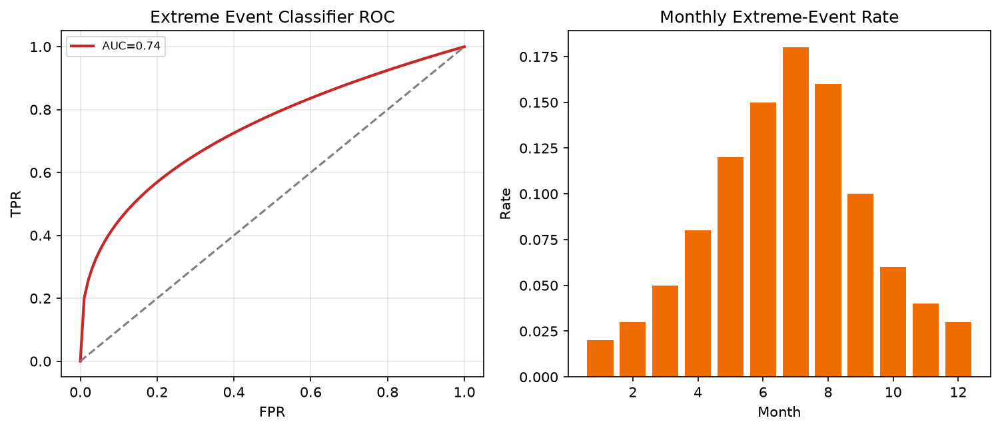

# ML for Extreme Weather Event Prediction

A comprehensive machine learning project for rare-event prediction in climate and weather systems. The repository includes Python, R, and notebook implementations with a focus on imbalance-aware metrics, calibration, and reproducible evaluation.

## Table of Contents

- Overview
- Features
- Project Structure
- Installation
- Usage
- Dataset Guidance
- Models and Metrics
- Outputs
- Best Practices
- License

## Overview

This project provides a practical baseline framework for extreme event prediction tasks such as heavy precipitation, high temperature, and extreme wind scenarios. It is designed for educational use, paper-review replication, and fast adaptation to real climate datasets.

## Features

- Percentile-based extreme labeling
- Python and R pipelines for model training and evaluation
- Interactive notebook workflow
- Rare-event metrics including PR-AUC and calibration-aware scoring
- Local output artifacts for metrics and figures

## Project Structure

```text
.
├── data/
│   └── .gitkeep
├── notebooks/
│   └── extreme_event_prediction_workflow.ipynb
├── outputs/
│   └── .gitkeep
├── r/
│   └── extreme_event_prediction.R
├── src/
│   ├── extreme_event_prediction.py
│   └── __init__.py
├── .gitattributes
├── .gitignore
├── LICENSE
├── requirements.txt
└── README.md
```

## Installation

```bash
python -m venv .venv
.\.venv\Scripts\activate
pip install -r requirements.txt
```

## Usage

### Python

```bash
python -m src.extreme_event_prediction
```

### R

```r
source("r/extreme_event_prediction.R")
```

### Notebook

```bash
jupyter notebook notebooks/extreme_event_prediction_workflow.ipynb
```

## Dataset Guidance

For real datasets, include:

- predictor variables (meteorological, lagged, and contextual)
- continuous target used to define extremes
- timestamp column for time-aware validation

## Models and Metrics

- Baselines: Logistic Regression and Random Forest
- Metrics: Precision, Recall, F1, ROC-AUC, PR-AUC, Brier score
- Validation: prefer blocked or rolling time splits for deployment realism

## Outputs

Generated artifacts (metrics/plots) are written under `outputs/` for easy reporting and comparison.

## Best Practices

- Prioritize leakage control over model complexity.
- Prefer PR-AUC and calibration checks for rare classes.
- Choose decision thresholds based on application costs.
- Report uncertainty and false-negative risk explicitly.


## Visualizations

A committed overview figure for this project (regenerated by the primary analysis/demo script when available):



Extreme-event class ROC curve and monthly event-rate bars for the classification demo.

> Demonstration figure from synthetic/demo or literature-summary inputs unless a licensed dataset is provided locally.

## License

MIT License. See `LICENSE`.

**Last Updated**: July 2025
