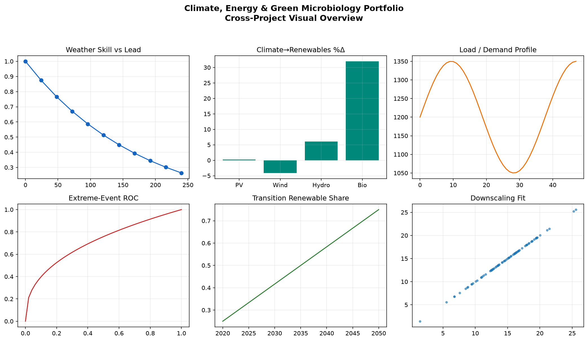
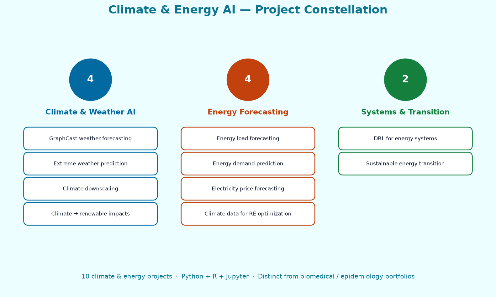

# Climate, Energy & Green Microbiology Portfolio

Multi-project laboratory of climate intelligence, energy systems analytics, and sustainability-focused machine learning by Nana Safo-Duker.
Each folder is a self-contained workflow targeting a distinct forecasting, optimization, or transition-planning problem, from extreme-weather prediction to energy demand/load/price modeling and climate-driven renewable optimization.

This README provides the cross-project narrative: structure, shared tooling, reproducibility expectations, and project-by-project context.

## Table of Contents
- [About](#about)
- [Portfolio Overview](#portfolio-overview)
- [Visualizations](#visualizations)
- [Repository Layout](#repository-layout)
- [Shared Setup Workflow](#shared-setup-workflow)
- [Workflow Blueprint](#workflow-blueprint)
- [Project Capsules](#project-capsules)
- [Data Sources and Governance](#data-sources-and-governance)
- [Testing and Validation Hooks](#testing-and-validation-hooks)
- [Extensibility Playbook](#extensibility-playbook)
- [Contributing](#contributing)
- [Roadmap](#roadmap)
- [Contact](#contact)

## About
**Description:** AI/ML portfolio spanning climate prediction, energy forecasting, renewable optimization, and sustainable transition modeling.
**Website:** https://nana-safo-duker.github.io/
**Topics:** climate-ai, energy-ml, renewable-energy, weather-forecasting, load-forecasting, electricity-pricing, sustainability, graph-neural-networks, forecasting.

## Portfolio Overview
- **Domains represented:** climate forecasting, extreme weather risk prediction, electricity price forecasting, load/demand forecasting, renewable resource optimization, transition scenario modeling.
- **Core methods:** tree ensembles, time-series forecasting, deep learning, graph-based weather models, probabilistic/statistical evaluation, explainable ML diagnostics.
- **Languages and runtimes:** Python, Jupyter Notebooks, selected R workflows where applicable.
- **Deliverables:** reproducible notebooks, scripts, trained model artifacts, diagnostic plots, and project-level documentation.
- **Operational model:** 13 standalone project folders for climate and energy analytics (the portfolio title retains “Green Microbiology” for branding continuity; there is no separate microbiology project folder in this repository).


## Visualizations

Portfolio-level figures in `assets/` summarize themes across all thirteen climate/energy projects. Each project folder also includes its own `assets/overview.png`.
### Cross-project analytical overview



### Project theme map (climate & energy only)

Constellation map of the **13 climate/energy folders** (weather AI, energy forecasting, systems/transition). This figure is unique to this repository — not shared with the biomedical or epidemiology portfolios:



> Root figures are illustrative summaries. Open any project folder for runnable pipelines and project-specific plots.

## Repository Layout
```text
Climate_Energy_GreenMicrobiology-Portfolio/
├── assets/                                      # Portfolio-level visualizations
│   ├── portfolio_overview.png
│   └── project_theme_map.png
├── AI-Based-Global-Weather-Forecasting_GraphCast/
├── Climate-Data-for-Renewable-Energy-Optimization/
├── Climate-change-impacts-on-renewable-energy-generation/
├── Deep-Learning-for-Climate-Downscaling-Generating-high-resolution-gridded-temperature-projects/
├── Deep-Reinforcement-Learning-for-Energy-Systems/
├── Energy-Load-Forecasting-Using-Machine-Learning/
├── Forecasting-Electricity-Price-IMachine-Learning-Models-and-Strategies/
├── ML-based-Energy-demand-prediction/
├── ML-for-Extreme-Weather-Event-Prediction/
├── Modelling-for-Sustainable-Energy-Transition/
├── Weather Forecasting with Diffusion models/
├── DeepSD Generating High Resolution Climate Change Projections through Single Image Super-Resolution/
├── ClimaX A foundation model for weather and climate/
└── README.md
```

Each project typically includes:
- `data/` or dataset placeholders / ingestion scripts
- `notebooks/` for EDA + experiment walkthroughs
- `src/` or `scripts/` for modular pipelines
- `results/`, `figures/`, `assets/` (README overview figure), or model checkpoints
- Project-specific README and setup notes

## Shared Setup Workflow
1. Clone repository:
   ```bash
   git clone https://github.com/Nana-Safo-Duker/Climate_Energy_GreenMicrobiology-Portfolio.git
   cd Climate_Energy_GreenMicrobiology-Portfolio
   ```
2. Enter one project folder.
3. Create or activate environment based on local files (`requirements.txt`, `environment.yml`, etc.).
4. Install dependencies and run notebooks/scripts.
5. Save generated artifacts under that project's `results/` or `models/` structure.

> Note: Some projects may include placeholder or sample data. Replace with licensed or institution-approved datasets for production-quality analysis.

## Workflow Blueprint
- **Problem selection:** choose forecasting, optimization, or transition domain.
- **Environment provisioning:** install project-specific dependencies.
- **Notebook rehearsal:** run exploratory notebooks for feature engineering and baseline metrics.
- **Script automation:** switch to CLI scripts for repeatable training/inference.
- **Evaluation pass:** generate and review RMSE/MAE/AUC/classification reports, plus plots.
- **Reporting/export:** package figures, metrics, and model artifacts for publication or stakeholder review.

## Project Capsules

### 1) Deep-Reinforcement-Learning-for-Energy-Systems
Focuses on RL-driven control and optimization for energy systems under dynamic conditions.
**Use cases:** policy optimization, adaptive control, cost/emission tradeoff tuning.

### 2) ML-for-Extreme-Weather-Event-Prediction
Builds models to detect and forecast severe weather events from climate and atmospheric signals.
**Use cases:** early warning systems, resilience planning, risk analytics.

### 3) Forecasting-Electricity-Price-IMachine-Learning-Models-and-Strategies
Compares ML strategies for electricity price index prediction and market behavior understanding.
**Use cases:** market operations, procurement strategy, volatility-aware planning.

### 4) Climate-Data-for-Renewable-Energy-Optimization
Uses climate variables to optimize renewable generation planning and siting/performance analysis.
**Use cases:** wind/solar yield planning, climate-informed capacity decisions.

### 5) Energy-Load-Forecasting-Using-Machine-Learning
Time-series and feature-based demand/load forecasting for short- and medium-term horizons.
**Use cases:** grid balancing, dispatch support, capacity planning.

### 6) AI-Based-Global-Weather-Forecasting_GraphCast
Graph-based AI weather modeling inspired by modern global forecasting architectures.
**Use cases:** high-dimensional weather prediction, large-scale atmospheric modeling.

### 7) Modelling-for-Sustainable-Energy-Transition
Scenario-centric analytics for decarbonization pathways and policy/technology transition strategies.
**Use cases:** transition roadmapping, scenario comparison, policy support.

### 8) Deep-Learning-for-Climate-Downscaling-Generating-high-resolution-gridded-temperature-projects
Deep learning for climate downscaling from coarse to high-resolution temperature grids.
**Use cases:** localized climate risk modeling, regional planning, adaptation studies.

### 9) Climate-change-impacts-on-renewable-energy-generation
Assesses how climate-change signals affect renewable generation potential over time.
**Use cases:** long-term investment strategy, climate stress testing of assets.

### 10) ML-based-Energy-demand-prediction
Machine-learning pipelines for aggregate or segment-level energy demand prediction.
**Use cases:** utility forecasting, demand-response design, infrastructure planning.

### 11) Weather Forecasting with Diffusion models
Continuous ensemble weather forecasting workflows inspired by diffusion-based probabilistic MLWP, including ARCI-style lead-time sampling and verification diagnostics.
**Use cases:** high-temporal-resolution ensemble prediction, uncertainty quantification, renewable-energy weather risk support.

### 12) DeepSD Generating High Resolution Climate Change Projections through Single Image Super-Resolution
Stacked SRCNN super-resolution for statistical climate downscaling, mapping coarse precipitation fields to high-resolution grids with topographic guidance.
**Use cases:** local climate-risk products, extreme precipitation downscaling, ensemble ESM post-processing for adaptation planning.

### 13) ClimaX A foundation model for weather and climate
Foundation-model workflows inspired by ClimaX: heterogeneous CMIP6-style pretraining concepts, variable-aware Transformer evaluation demos, and synthetic skill/projection/downscaling diagnostics in Python, R, and Jupyter.
**Use cases:** multi-task weather forecasting evaluation, ClimateBench-style projection transfer demos, climate downscaling comparisons, scalable Earth-system ML prototyping.

## Data Sources and Governance
- Use only datasets with clear license terms and permitted reuse.
- Keep sensitive/private data outside the repository.
- Store credentials and paths in `.env` or secure config (gitignored).
- Document provenance, preprocessing assumptions, and temporal coverage for each project.

## Testing and Validation Hooks
- Re-run notebooks/scripts with fixed seeds where possible.
- Track baseline metrics per project (e.g., MAE/RMSE/MAPE/AUC).
- Version key plots (error curves, residual analysis, confusion matrices).
- Add smoke tests for data loading and training pipeline integrity.

## Extensibility Playbook
- Add new projects with the same folder contract (`data`, `notebooks`, `scripts/src`, `results`, docs).
- Promote reusable utilities into a shared `common/` package when overlap grows.
- Add model cards and dataset cards to improve transparency.
- Introduce CI checks for linting, environment validation, and notebook smoke tests.

## Contributing
1. Create a branch: `git checkout -b feature/<name>`
2. Keep edits scoped to a single project unless refactoring shared utilities.
3. Update both project-level docs and this root README when behavior changes.
4. Validate runs and include metrics/plots in PR descriptions.
5. Open a PR with reproducibility notes and data/license context.

## Roadmap
- Standardize dependency/environment files across all project folders.
- Add consistent model evaluation reports and comparison dashboards.
- Introduce lightweight CI for notebook/script smoke tests.
- Publish tagged portfolio releases by theme (weather, demand/load, market, transition).
- Expand documentation on data lineage and model governance.

## Contact
For collaboration, consulting, or demo requests, open an issue or connect via:
https://nana-safo-duker.github.io

---

Also see related repositories under Nana Safo-Duker's GitHub profile for adjacent sustainability and analytics workflows.

**Last Updated**: September 2025
