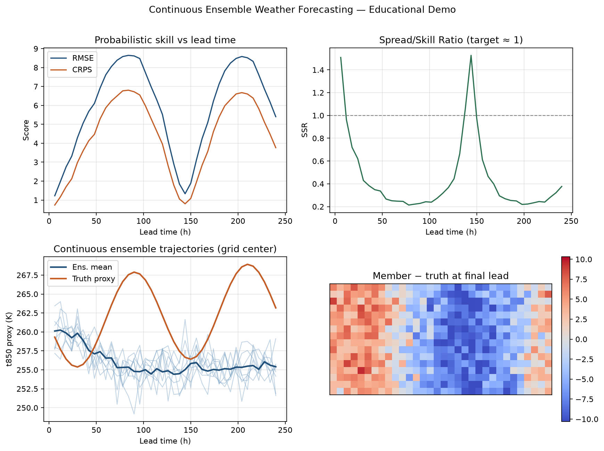
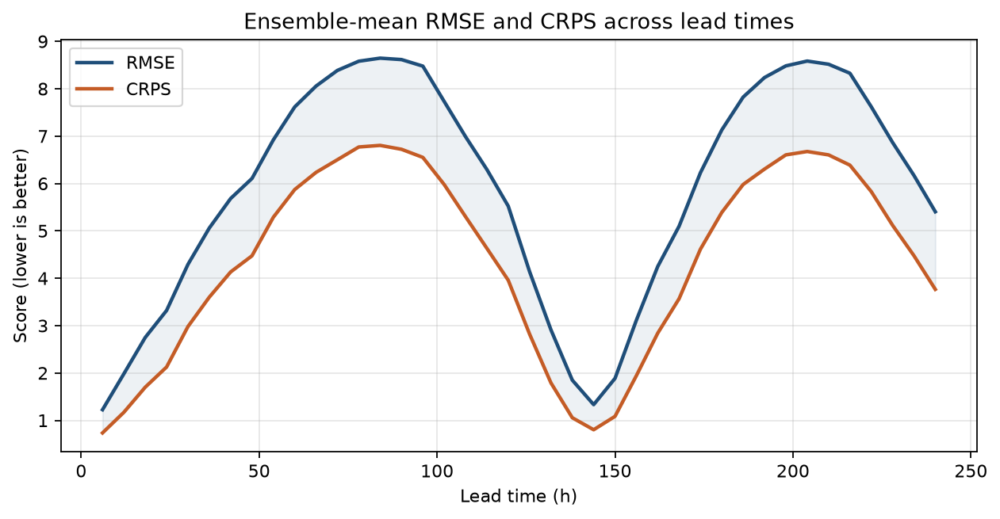
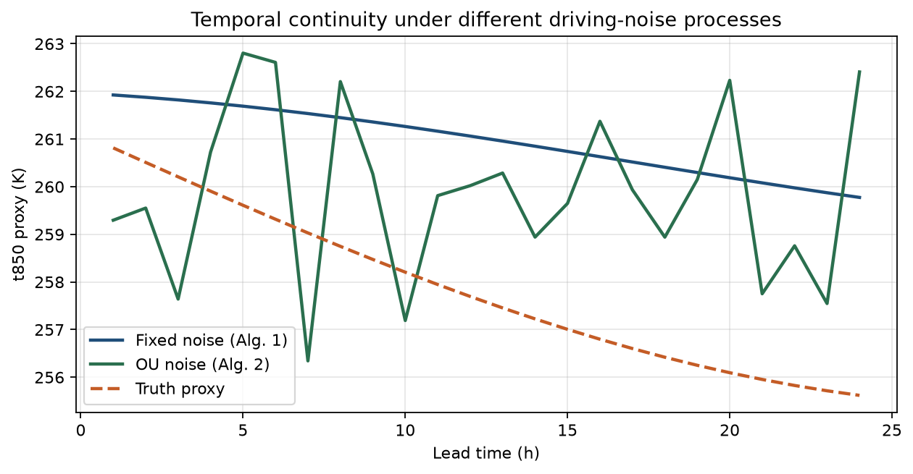
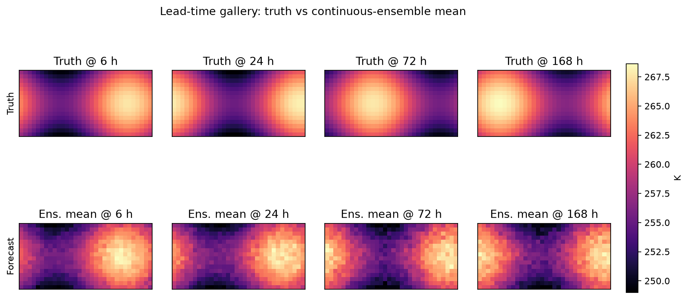
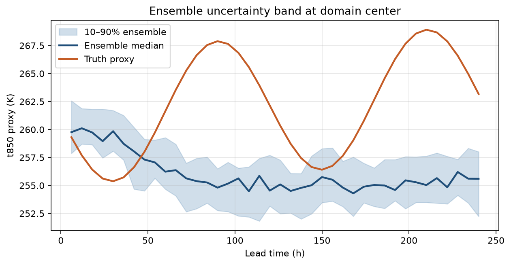
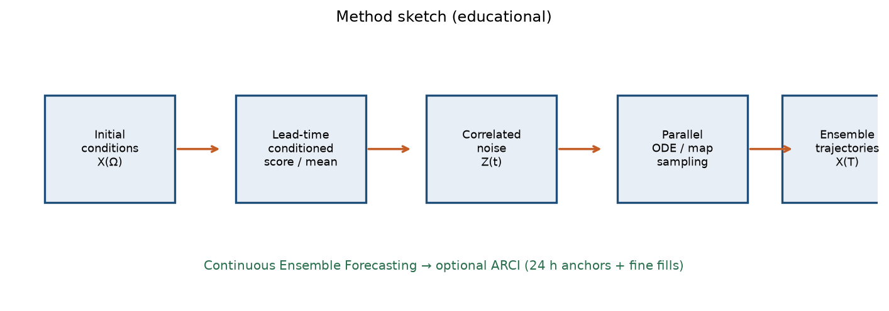

# Weather Forecasting with Diffusion Models

Educational and reproducible companion to *Continuous Ensemble Weather Forecasting with Diffusion models* (Andrae, Landelius, Oskarsson & Lindsten, 2024). This repository includes Python, R, and Jupyter workflows that demonstrate continuous ensemble forecasting, ARCI-style hybrids, and probabilistic verification (RMSE, CRPS, SSR).

## Table of Contents

- [Overview](#overview)
- [Paper](#paper)
- [Features](#features)
- [Project Structure](#project-structure)
- [Installation](#installation)
- [Usage](#usage)
- [Method Summary](#method-summary)
- [Metrics](#metrics)
- [Data Guidance](#data-guidance)
- [Outputs](#outputs)
- [Limitations](#limitations)
- [References](#references)
- [License](#license)

## Overview

Diffusion-based ML weather models can produce sharp ensemble members, but fine temporal resolution often forces many autoregressive steps and accumulated error. This project teaches the paper’s answer:

1. **Condition** a generative forecast on continuous lead time.
2. **Correlate** driving noise across lead times so members form coherent trajectories.
3. **Hybridize** with long autoregressive anchors (**ARCI**) for multi-day skill at hourly/sub-daily resolution.

The included code is a **lightweight educational analogue** (synthetic fields + lead-time–conditioned means + correlated noise). It is designed for coursework, paper review, and portfolio demonstration—not as a drop-in replacement for the authors’ full U-Net diffusion training stack.

## Paper

| Item | Detail |
|---|---|
| Title | Continuous Ensemble Weather Forecasting with Diffusion models |
| Authors | Martin Andrae, Tomas Landelius, Joel Oskarsson, Fredrik Lindsten |
| Preprint | [arXiv:2410.05431](https://doi.org/10.48550/arXiv.2410.05431) |
| ResearchGate | [Publication 384769942](https://www.researchgate.net/publication/384769942_Continuous_Ensemble_Weather_Forecasting_with_Diffusion_models) |
| Author code | [martinandrae/Continuous-Ensemble-Forecasting](https://github.com/martinandrae/Continuous-Ensemble-Forecasting) |

## Features

- Python CLI pipeline with ARCI demo, metrics export, and overview figure
- R diagnostics script mirroring probabilistic scores and plots
- Detailed Jupyter notebook walking through Algorithms 1–3 concepts
- Synthetic startup data (no ERA5 download required)
- Clear upgrade path to WeatherBench / ERA5 research workflows

## Project Structure

```text
.
├── assets/
│   ├── overview.png
│   ├── skill_curves.png
│   ├── noise_comparison.png
│   ├── field_gallery.png
│   ├── ensemble_spread.png
│   └── method_schematic.png
├── data/
│   └── .gitkeep
├── notebooks/
│   └── continuous_ensemble_forecasting_workflow.ipynb
├── outputs/
│   └── .gitkeep
├── r/
│   └── continuous_ensemble_forecasting.R
├── src/
│   ├── __init__.py
│   └── continuous_ensemble_forecasting.py
├── .gitattributes
├── .gitignore
├── LICENSE
├── requirements.txt
└── README.md
```

Local-only writing artifacts (retained on disk, excluded from git via `.gitignore`):

- `Guidelines_Research_Paper_Review.txt`
- `Continuous_Ensemble_Weather_Forecasting_Diffusion_Blog_Post.md`

## Installation

### Python

```bash
python -m venv .venv
# Windows PowerShell
.\.venv\Scripts\Activate.ps1
python -m pip install -r requirements.txt
```

### R

Base R is sufficient for the diagnostics script (`stats`, `graphics`, `grDevices`, `utils`). Optional tidyverse packages can be added later for extended reporting.

## Usage

Run commands from the project root.

### Python pipeline

```bash
python -m src.continuous_ensemble_forecasting
```

Useful flags:

```bash
python -m src.continuous_ensemble_forecasting --n-ens 40 --n-hours 240 --ar-step-hours 24 --interp-hours 6 --rho 2.302585
```

### R diagnostics

```bash
Rscript r/continuous_ensemble_forecasting.R
```

### Notebook

```bash
jupyter notebook notebooks/continuous_ensemble_forecasting_workflow.ipynb
```

## Method Summary

| Component | Role in this repo |
|---|---|
| Lead-time conditioning | Query a forecast map at arbitrary \(t\) |
| Fixed / OU noise | Build temporally consistent ensemble trajectories |
| ARCI hybrid | 24 h autoregressive anchors + continuous fills (default 6 h) |
| Probabilistic verification | RMSE, CRPS (Gaussian form), SSR |

Conceptual mapping to the paper:

- **Algorithm 1** → fixed-noise continuous ensemble
- **Algorithm 2** → Ornstein–Uhlenbeck autocorrelated noise
- **Algorithm 3 (ARCI)** → autoregressive rollouts with continuous interpolation

## Metrics

- **RMSE**: error of the ensemble mean vs truth proxy
- **CRPS**: distributional skill (closed-form Gaussian approximation in the demo)
- **SSR**: ensemble spread divided by RMSE; well-calibrated forecasts target ≈ 1

These mirror the paper’s evaluation philosophy on WeatherBench ERA5 (z500, t850, surface fields), where diffusion ensembles often showed SSR < 1 (mild underdispersion).

## Data Guidance

Default workflows generate synthetic fields. For research replication:

1. Download WeatherBench / ERA5 at the resolution you can afford (paper uses 5.625° for the reported experiments).
2. Standardize variables (subtract mean, divide by std).
3. Include static fields (land–sea mask, orography) if matching the paper setup.
4. Preserve chronological train/val/test splits (paper: 1979–2015 / 2016–2017 / 2018).
5. Replace `score_conditioned_mean` with a trained conditional diffusion score network and ODE sampler.

Suggested local layout:

```text
data/
  raw/
  processed/
outputs/
  metrics/
  figures/
models/
```

## Outputs

Typical artifacts after running the Python pipeline:

| File | Description |
|---|---|
| `outputs/ensemble_metrics.csv` | Lead-time RMSE / CRPS / SSR table |
| `outputs/summary.json` | Run configuration and aggregate scores |
| `outputs/overview.png` | Four-panel diagnostic figure |
| `assets/overview.png` | README overview dashboard |
| `assets/skill_curves.png` | RMSE / CRPS vs lead time |
| `assets/noise_comparison.png` | Fixed vs OU noise continuity |
| `assets/field_gallery.png` | Truth vs ensemble-mean maps |
| `assets/ensemble_spread.png` | Uncertainty band at grid center |
| `assets/method_schematic.png` | Method flow sketch |

R writes `outputs/ensemble_metrics_r.csv`, `outputs/summary_r.txt`, and `outputs/overview_r.png`.

## Visualizations

Figures below are regenerated by:

```bash
python -m src.continuous_ensemble_forecasting
```

### Overview dashboard



Four-panel summary: skill scores, SSR calibration, continuous member trajectories, and a final-lead residual map.

### Probabilistic skill curves



Ensemble-mean **RMSE** and **CRPS** as a function of lead time (lower is better).

### Driving-noise continuity



Fixed noise (Algorithm 1 style) versus Ornstein–Uhlenbeck noise (Algorithm 2 style) against the synthetic truth trajectory.

### Lead-time field gallery



Truth (top) versus continuous-ensemble mean (bottom) at selected lead times.

### Ensemble uncertainty band



10–90% ensemble percentile band and median at the domain center, compared with the truth proxy.

### Method schematic



Educational sketch of Continuous Ensemble Forecasting and optional ARCI hybridization.

> Demonstration figures from synthetic/demo inputs unless a licensed ERA5/WeatherBench dataset is provided locally.

## Limitations

- Demo code is pedagogical; it does **not** train the paper’s diffusion U-Net.
- Synthetic dynamics are smoother and lower-dimensional than global ERA5.
- CRPS uses a Gaussian approximation rather than empirical ensemble CRPS estimators used in operational verification.
- GPU ODE sampling, multi-seed uncertainty, and 0.25° scaling are out of scope here (see paper Limitations).

## References

- Andrae, M., Landelius, T., Oskarsson, J., & Lindsten, F. (2024). Continuous Ensemble Weather Forecasting with Diffusion models. *arXiv:2410.05431*.
- Hersbach, H., et al. (2020). The ERA5 global reanalysis. *QJRMS*.
- Gneiting, T., & Raftery, A. E. (2007). Strictly proper scoring rules… *JASA*.
- Karras, T., et al. (2022). Elucidating the design space of diffusion-based generative models. *NeurIPS*.
- Rasp, S., et al. (2020). WeatherBench. *JAMES*.

## License

MIT License. See [`LICENSE`](LICENSE).

**Last Updated**: July 2026
